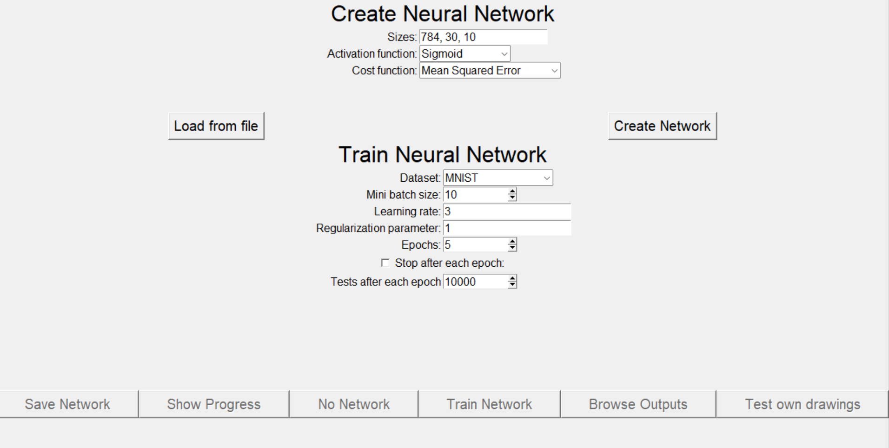
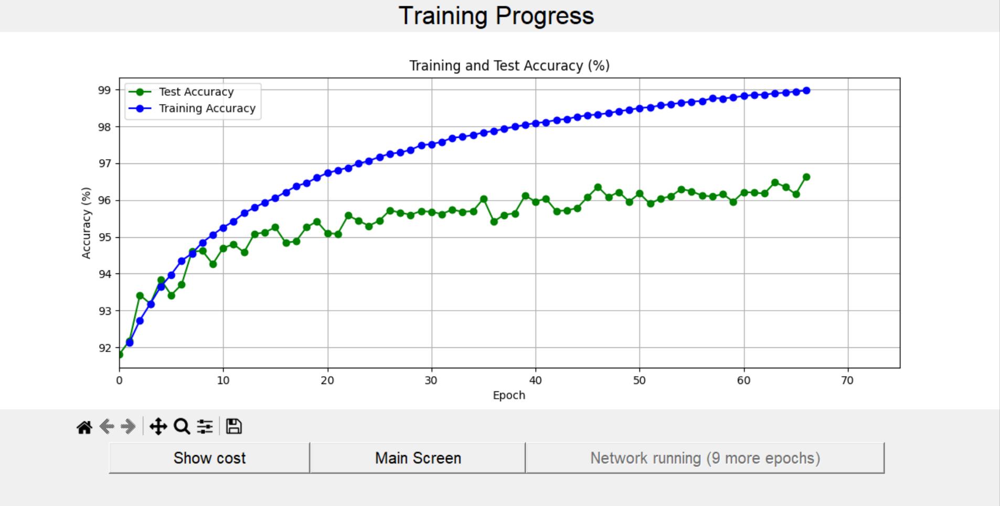
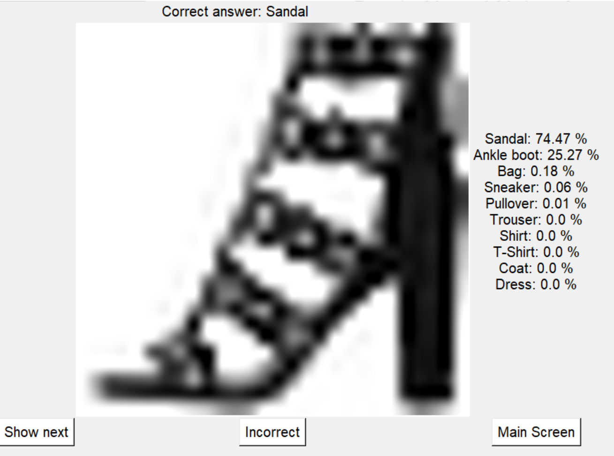
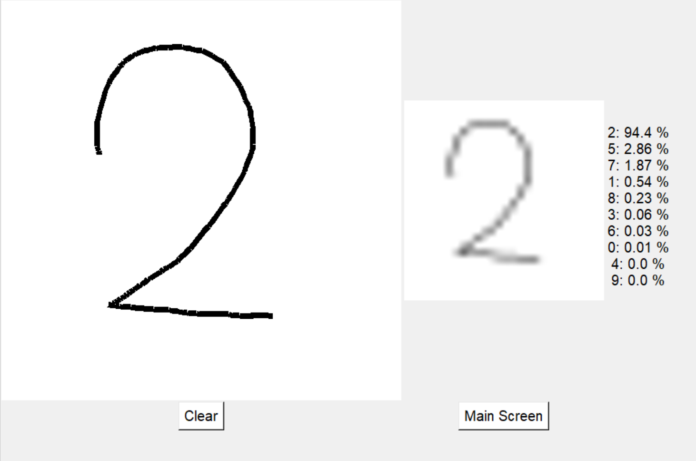

## Neural Networks GUI
This project is a Tkinter GUI for creating and training MLP (Multi-Layer Perceptron) Neural Networks. It is inspired by [Neural Networks and Deep Learning](http://neuralnetworksanddeeplearning.com/) by Michael Nielsen and [Sebastian Lague's amazing video on Neural Networks](https://www.youtube.com/watch?v=hfMk-kjRv4cs).

It enables creating neural networks with custom layer sizes and training it on  Digits MNIST, Fashion MNIST and Quickdraw datasets with basic backpropagation algorithm.

In the Show Progress Screen, it monitors the accuracy and cost throughout multiple training epochs.

You can view the results of the last testing and see which test cases were problematic by clicking the Browse Outputs button. You can also test the network's performance on custom drawings (draw with left mouse button and erase with right button).

### Screenshots
<figure>

  <figcaption style="text-align:center">Main screen of the application.</figcaption>
</figure>
<figure>

<figcaption style="text-align:center">View the network's accuracy or cost in a matplotlib plot.</figcaption>
</figure>

<figure>

  <figcaption style="text-align:center">See how the network performed in the last testing stage (showing Fashion MNIST dataset).</figcaption>
</figure>

<figure>

  <figcaption style="text-align:center">See the network's performance on custom drawings (showing original MNIST dataset).</figcaption>
</figure>